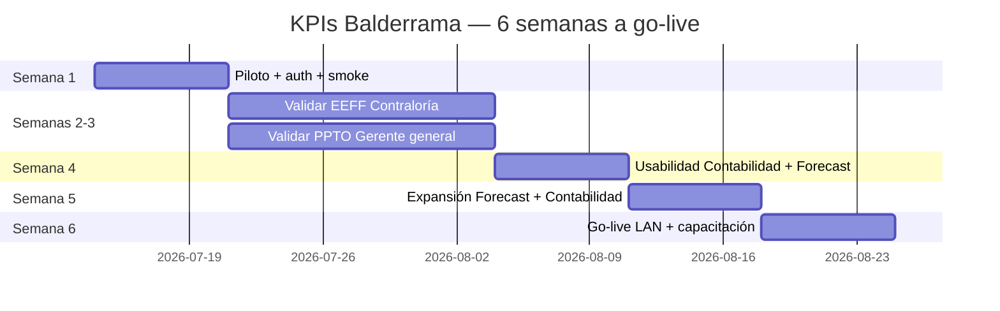

# Plan del proyecto — KPIs BALDERRAMA

**Versión:** 1.1 · **Fecha:** 13 jul 2026  
**Base:** [DOCUMENTACION.md](./DOCUMENTACION.md) + [README.md](./README.md)

---

## 1. Objetivo

Entregar un **dashboard ejecutivo confiable** sobre GMOFARRIL para dirección, comercial, contabilidad y postventa.

**Go-live objetivo:** **24 ago 2026** (6 semanas desde 13 jul 2026).

**Éxito medible**
- Stakeholders consultan el dashboard en lugar de Excel ad hoc.
- EEFF aceptado por **Contraloría** y PPTO 2026 por **Gerente general**.
- Módulos **Forecast** y **Contabilidad/EEFF** reforzados en esta iteración.
- Acceso solo con **login activo** (`AUTH_ENABLED=true`).

---

## 2. Decisiones cerradas

| Tema | Decisión |
|------|----------|
| Horizonte | **6 semanas** → go-live ~**24 ago 2026** |
| Validación EEFF | **Contraloría** |
| Validación PPTO 2026 | **Gerente general** |
| Foco de expansión (Fase 3) | **Forecast** + **Contabilidad / EEFF** |
| Piloto | **Login activo** desde la semana 1 |

---

## 3. Stakeholders

| Rol | Responsabilidad |
|-----|-----------------|
| **Contraloría** | Firmar EEFF (real vs reporte oficial) y prorrateo admin 2026 |
| **Gerente general** | Firmar comparativa PPTO 2026 (líneas críticas) |
| Contabilidad operativa | Apoyo day-to-day en catálogo / VTASMEN / ETL |
| Comercial / gerencia | Uso de forecast e inventario |
| TI / desarrollo | Backend, UI, auth, despliegue LAN |
| Dirección | Go/no-go de go-live |

---

## 4. Calendario a 6 semanas

| Semana | Fechas | Fase | Enfoque |
|--------|--------|------|---------|
| **1** | 14–20 jul | 0 + arranque | Auth, usuarios piloto, smoke, checklist |
| **2** | 21–27 jul | 1a | Contraloría: EEFF + prorrateo |
| **3** | 28 jul – 3 ago | 1b | GG: PPTO; cierre discrepancias EEFF |
| **4** | 4–10 ago | 2 | Performance/UX Contabilidad + Forecast |
| **5** | 11–17 ago | 3 | Features Forecast + Contabilidad |
| **6** | 18–24 ago | 4 | Producción LAN, capacitación, v1.0 |

---

## 5. Plan por semana (detalle)

### Semana 1 (14–20 jul) — Piloto con login

| # | Entregable | Dueño | Hecho cuando… |
|---|------------|-------|----------------|
| 1.1 | `AUTH_ENABLED=true` en ambiente piloto | TI | Solo entran con usuario/contraseña |
| 1.2 | Cuentas por rol (ver [PILOTO_USUARIOS.md](./PILOTO_USUARIOS.md)) | TI + áreas | Cada área tiene al menos 1 usuario |
| 1.3 | Ejecutar `node backend/scripts/seed-piloto-users.js` | TI | Store sincronizado |
| 1.3 | Smoke test: login + 1 carga por módulo | TI | Checklist firmado (sin 500 / pantos) |
| 1.4 | Docs leíbles: README + DOCUMENTACION + este plan | TI | Links y fechas actualizados |
| 1.5 | Agenda Contraloría + GG → [AGENDA_VALIDACION.md](./AGENDA_VALIDACION.md) | TI / Dirección | Reuniones calendarizadas |

**Demo fin de semana 1:** login funciona; cada rol ve solo sus páginas.

---

### Semanas 2–3 (21 jul – 3 ago) — Confianza numérica

**Contraloría (EEFF)**
- Comparar 1–2 periodos (ej. jun 2026 y YTD) dashboard vs reporte/Excel oficial.
- Revisar prorrateo administración **2026** (matriz Piso 38.56%, etc.).
- Lista de discrepancias: causa + fix o “aceptado como diferencia de criterio”.
- **Criterio de aceptación:** Contraloría da visto bueno por escrito (mail / acta corta).

**Gerente general (PPTO)**
- Revisar líneas críticas reales vs presupuesto 2026 (ventas, gastos clave, utilidad).
- Confirmar archivo `presupuesto-2026.xlsx` como fuente oficial del año.
- **Criterio de aceptación:** GG da visto bueno a la comparativa PPTO.

| # | Entregable | Prioridad |
|---|------------|-----------|
| 2.1 | Acta EEFF Contraloría | P0 |
| 2.2 | Acta PPTO Gerente general | P0 |
| 2.3 | Fixes de números bloqueantes | P0 |
| 2.4 | Bugs del piloto (SEP, mes curso, etc.) si impactan confianza | P1 |

**Demo fin semana 3:** cifras EEFF/PPTO aceptadas o con gaps documentados no bloqueantes.

---

### Semana 4 (4–10 ago) — Usabilidad Contabilidad + Forecast

| # | Entregable | Notas |
|---|------------|-------|
| 4.1 | Performance carga EEFF / Contabilidad | Loaders, menos waiting percibido o query tuning |
| 4.2 | Claridad UI Contabilidad (tabs Catálogo / EEFF, filtros) | Misma UX de fechas |
| 4.3 | Forecast: mensajes de horizonte, fuente SQL, precisión | Evitar ambigüedad “histórico vs pronóstico” |
| 4.4 | Export básico (CSV) de tablas EEFF y/o forecast mensual | Pedido típico dirección |
| 4.5 | Despliegue documentado (servicio / PM2 / script Windows) | Preparar go-live |

**Demo fin semana 4:** Contabilidad y Forecast usables en diario sin acompañamiento de TI.

---

### Semana 5 (11–17 ago) — Expansión acordada

Solo **Forecast** y **Contabilidad** (fuera de alcance esta iteración: alertas SEP, móvil, multi-año PPTO, IA profunda, etc.).

**Forecast (elegir 2–3 ítems concretos al inicio de la semana)**
- Pronóstico por canal y/o sucursal (si hay datos).
- Mejor visualización (serie + tabla + notas de modelo).
- Indicadores de confianza (MAPE, rango) más visibles para gerencia.

**Contabilidad / EEFF**
- Mejoras post-validación (drill-down, etiquetas, exports).
- Ajustes de nomenclatura / PPTO que haya pedido GG o Contraloría.
- Estabilidad del orquestador `/contabilidad` (tiempos, errores).

**Demo fin semana 5:** features nuevas vistas por Gerente general / Contraloría / comercial.

---

### Semana 6 (18–24 ago) — Go-live

| # | Entregable |
|---|------------|
| 6.1 | Ambiente productivo en servidor LAN (`.env` seguro, auth ON) |
| 6.2 | Backup controlado de `presupuesto-2026.xlsx` y nomenclatura |
| 6.3 | Capacitación corta: Contraloría, GG, contabilidad, comercial |
| 6.4 | Canal de soporte (quién reporta / quién corrige números vs bugs) |
| 6.5 | Congelar **v1.0**; backlog v1.1 (postventa, alertas, IA, etc.) |

**Go/no-go (24 ago):** auth OK + EEFF OK Contraloría + PPTO OK GG + Contabilidad/Forecast estables.

---

## 6. Fuera de alcance v1.0 (backlog v1.1+)

- Alertas inventario SEP / aging agresivas  
- Mejoras mobile profundas  
- Presupuesto multi-año o carga PPTO desde UI  
- Expansión fuerte del asistente IA  
- Módulo seminuevos dedicado  
- Limpieza masiva de `backend/scripts/` (salvo lo que estorbe al despliegue)

---

## 7. Riesgos (actualizados)

| Riesgo | Impacto | Mitigación |
|--------|---------|------------|
| Agenda de Contraloría / GG se atrasa | Alto | Calendarizar en sem. 1; tener paquetes de comparación listos |
| Discrepancia EEFF vs oficial | Alto | Semanas 2–3 solo fixes de números; no features nuevas |
| Auth bloquea demos | Medio | Usuarios piloto creados día 1; rol demo si hace falta |
| Scope creep en sem. 5 | Medio | Solo Forecast + Contabilidad; resto → v1.1 |
| SQL 2008 / latencia | Medio | Tuning en sem. 4; no queries modernas |

---

## 8. Checklist de go-live (24 ago)

- [ ] `AUTH_ENABLED=true` en producción  
- [ ] Usuarios activos por rol  
- [ ] Visto bueno **EEFF — Contraloría**  
- [ ] Visto bueno **PPTO — Gerente general**  
- [ ] Contabilidad/EEFF estable en LAN  
- [ ] Forecast estable (histórico 12m + horizonte)  
- [ ] Procedimiento de reinicio documentado  
- [ ] Capacitación mínima hecha  
- [ ] v1.0 etiquetada / backlog v1.1 abierto  

---

## 9. Seguimiento

- Actualizar este archivo al cierre de **cada semana** (fecha + qué se aceptó).  
- Demos fijas: fin sem. 1, 3, 5 y go-live sem. 6.  
- Dueño del plan (TI): confirmar con Contraloría y GG los horarios de revisión en sem. 1.
