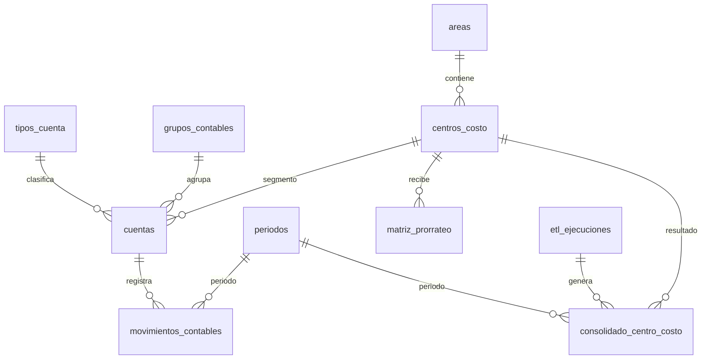

# Base de datos analítica — KPIs BALDERRAMA

Modelo dimensional para reporteo, ETL y configuración. **No reemplaza GMOFARRIL** (`CON_CTAS`, `CON_MOVDET`); actúa como capa de datos propia del dashboard.

## Origen de los datos

| Fuente GMOFARRIL | Rol | Tabla destino |
|------------------|-----|---------------|
| `CON_CTAS01{AAAA}` | Plan de cuentas + saldos mensuales | `cuentas`, `movimientos_contables` |
| `CON_MOVDET01{AAAA}` | Detalle de pólizas (trazabilidad) | futuro: `movimientos_poliza` |
| `CON_CONFESTADORESULTADO` | Líneas EEFF / VTASMEN | `estados_financieros`, `lineas_estado_resultado` |
| Excel *Total de cuentas* | Catálogo maestro (1 443 cuentas) | `cuentas` |
| Excel *Gatos para buscar origen* | Gastos 0700 por departamento | `cuentas` + `grupos_contables` |

## Diagrama ER (simplificado)



## Capas del modelo

### 1. Catálogo (dimensiones)
- **tipos_cuenta** — Activo, Ingreso, Costo, Gasto, Financiero
- **grupos_contables** — `CTA_GPOCONT` (400, 711, 740…)
- **areas** — autos nuevos, servicio, refacciones, admin…
- **centros_costo** — Piso, Foráneos, Cholula…
- **subcuentas_gasto** — 0011 comisiones, 0076 plan piso, 0080 rentas
- **cuentas** — Plan completo (`PPPP-SSSS-CCCC-FFFF`)

### 2. Hechos (transacciones y resultados)
- **movimientos_contables** — Cargo/abono/neto por cuenta y mes
- **consolidado_centro_costo** — Resultado ETL (Utilidad Bruta → Operativa)
- **bolson_administrativo** — Gasto admin sin asignar (GPOCONT 740)
- **prorrateo_detalle** — Distribución del bolsón

### 3. Configuración
- **reglas_mapeo_cuenta** — Prefijos 0400-0001 → ingreso Piso
- **matriz_prorrateo** — % de asignación admin → operativos
- **vtasmen_sucursales** — Config VTASMEN (grupos 711–718)

## Instalación

```sql
-- En SQL Server (misma instancia o base dedicada)
:r 01_schema.sql
:r 02_seed.sql
```

Para cargar el catálogo desde GMOFARRIL:

```bash
node scripts/sync-catalogo-cuentas.js
```

## Convención de número de cuenta

```
PPPP - SSSS - CCCC - FFFF
 │      │      │      └── Detalle auxiliar
 │      │      └── Centro / sucursal (0001 Piso, 0002 Foráneos…)
 │      └── Subrubro (0011 comisiones, 0076 plan piso…)
 └── Rubro principal (0400 ingreso, 0600 costo, 0700 gasto…)
```
